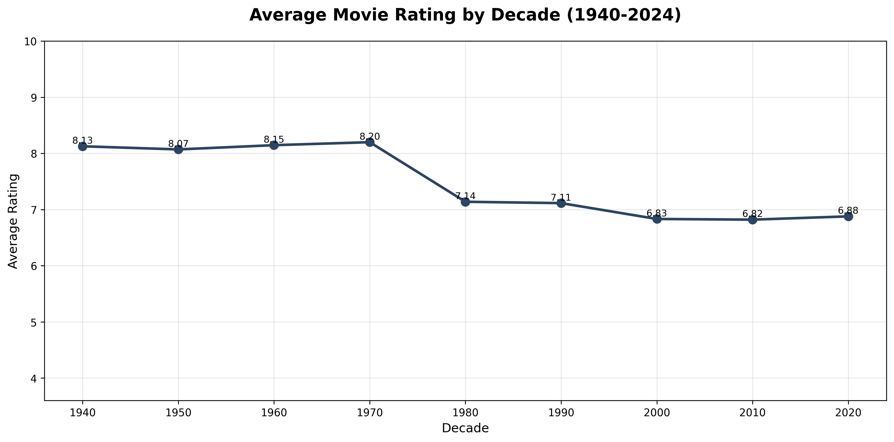

# 🎬 The Evolution of Cinema: A Data Story

A data-driven exploration of cinema's 84-year journey, revealing surprising truths about movie quality, box office success, and the golden age of film.

[](https://YOUR-USERNAME.github.io/cinema-data-story/)



## 📊 Project Overview

This project analyzes 1,000 IMDB movies from 1940 to 2024 to answer a timeless question: **Are movies getting better or worse?**

### Key Findings

- 📉 **Quality Decline**: Movie ratings peaked in the 1970s (8.20) and have dropped to 6.88 in the 2020s
- 💰 **Money ≠ Quality**: Only 0.115 correlation between box office revenue and ratings
- 🎭 **Genre Explosion**: Massive diversification in the 2000s with Documentary, Horror, Musical, Fantasy, and Comedy leading

## 🛠️ Technologies Used

- **Python** - Data analysis and manipulation
- **Pandas** - Data cleaning and processing
- **Matplotlib** - Data visualization
- **Seaborn** - Statistical graphics
- **NumPy** - Numerical computing
- **HTML/CSS** - Interactive web presentation

## 📁 Dataset

**Source**: [IMDB Movies Dataset on Kaggle](https://www.kaggle.com/datasets/ashrafkhetran/imdb-movies-dataset-trends-and-eda-insights/data)

- **Size**: 1,000 movies
- **Time Range**: 1940-2024
- **Key Variables**: Rating, Revenue, Genre, Year, Director, Runtime

## 🎨 Visualizations

1. **Average Rating by Decade** - Temporal trend analysis showing the decline in movie quality
2. **Revenue vs Rating Scatter Plot** - Correlation analysis between financial success and critical acclaim
3. **Genre Evolution Area Chart** - Distribution of top 5 genres across decades

## 📈 Analysis Approach
```python
# Load and clean data
df = pd.read_csv('imdb_movies.csv')
df['decade'] = (df['year'] // 10) * 10

# Analyze ratings over time
decade_ratings = df.groupby('decade')['rating'].mean()

# Correlation analysis
correlation = df['rating'].corr(df['gross_millions'])
```

## 🚀 View Live

Check out the interactive story: [The Evolution of Cinema](https://vanisharma24.github.io/The-Evolution-of-Cinema/)

## 📂 Project Structure
```
cinema-data-story/
│
├── index.html                  # Main webpage
├── ratings_by_decade.png       # Visualization 1
├── revenue_vs_rating.png       # Visualization 2
├── genre_evolution.png         # Visualization 3
├── imdb.py                     # Python analysis script
└── README.md                   # Project documentation
```

## 💡 Insights

The data reveals a compelling narrative: while cinema has become more diverse and accessible, average quality has declined since its golden age in the 1970s. However, this democratization means audiences now have unprecedented choice in selecting films that match their preferences.

## 🎯 Challenge Context

Created for the **Data Storytelling Challenge** - February 2026

**Mission**: Use data to tell a story about something you love

## 👤 Author

**Vani Sharma**

- GitHub: [@vanisharma24](https://github.com/vanisharma24)
- Project: [The Evolution of Cinema](https://github.com/vanisharma24/The-Evolution-of-Cinema)

## 📜 License

This project is open source and available for educational purposes.

## 🙏 Acknowledgments

- Dataset provided by [Ashraf Khetran](https://www.kaggle.com/ashrafkhetran) on Kaggle
- Inspired by a passion for cinema and data storytelling

---

⭐ **If you found this analysis interesting, please star this repository!**